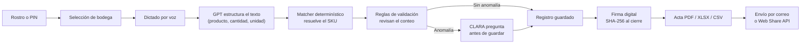

# CLARA — Captura por Lenguaje Asistido con Reconocimiento y Análisis


> **Cuentas claras, cocina tranquila.**

CLARA es un asistente de voz para la toma física de inventarios en las cocinas y bodegas de Colsubsidio. El operario se identifica con el rostro o un PIN, **dicta en voz alta lo que contó** — _"quedan nueve cajas de harina"_ — y CLARA transcribe, **valida en tiempo real** contra el catálogo y el histórico, y al cierre genera un **acta firmada digitalmente** con reportes listos para el ERP.

Proyecto del **Reto 4 · "Captura inteligente en operaciones de cocina"**, Hackathon Colsubsidio × 30X (22–26 de julio de 2026).

## Contenido

- [El problema](#el-problema)
- [Pruébalo ahora](#pruébalo-ahora)
- [Qué lo hace diferente](#qué-lo-hace-diferente)
- [Cómo funciona](#cómo-funciona)
- [Equipo](#equipo)
- [Documentación técnica](#documentación-técnica)

## El problema

Colsubsidio entregó para el reto el inventario real de Piscilago: 48 bodegas y 1.405 referencias. Al analizarlo encontramos que la cadena actual — papel, digitación y revisión semanas después — ya venía fallando:

| Hallazgo en la data real                            | Magnitud |
| --------------------------------------------------- | -------- |
| Saldos negativos físicamente imposibles             | 79       |
| Referencias sin código de catálogo (18 %)           | 252      |
| Unidades "fantasma" (registradas, nunca existieron) | 47.588   |

Ninguno de estos es un error de conteo: son errores de _transcripción_ acumulados en una cadena que nadie valida hasta que ya es tarde. CLARA elimina esa cadena — la validación ocurre en el instante de la captura, no semanas después.

## Pruébalo ahora

**Demo en vivo:** _(agregar la URL cuando el despliegue esté disponible)_

¿Prefieres correrlo en tu máquina? La guía completa está en [Ejecutar localmente](#ejecutar-localmente); toma menos de cinco minutos.

Recomendamos entrar desde un **dispositivo móvil** — idealmente una tablet, aunque un teléfono también funciona bien —, ya que CLARA está diseñada tablet-first y el micrófono se usa igual que en una operación real de bodega. Al ser una PWA, el navegador va a ofrecer la opción de **instalarla como aplicación** en el dispositivo (en Chrome/Android suele aparecer como "Agregar a pantalla de inicio" o un ícono de instalación en la barra de direcciones); vale la pena probarla instalada, así es como se usaría en una cocina real.

Cuenta de prueba, disponible siempre que el servidor arranque con una base de datos nueva:

| Campo           | Valor           |
| --------------- | --------------- |
| Cédula o nombre | `Test` o `0123` |
| PIN             | `1111`          |

También puedes registrar tu propia cuenta desde la app (nombre, cédula, correo, PIN y firma). Si usas el reconocimiento facial para identificarte, hazlo en un lugar con buena iluminación y con el rostro despejado y centrado en la cámara — el modelo corre en el dispositivo y necesita ver el rostro con claridad para reconocerlo de forma confiable.

Un recorrido guiado de dos minutos:

1. Inicia sesión con la cuenta de prueba (o con reconocimiento facial, si tu cámara y el modelo están disponibles).
2. Elige una bodega y dicta: _"quedan nueve cajas de harina"_.
3. Observa cómo CLARA transcribe, valida contra el histórico y agrega el registro en tiempo real.
4. Prueba una anomalía, por ejemplo _"quedan cero gaseosas"_ — CLARA debe preguntar antes de guardar.
5. Cierra la toma, firma con tu PIN y genera el acta en PDF, XLSX o CSV desde el resumen.
6. Prueba compartir el acta con los botones de compartir de cada formato — funcionan de verdad, con el panel nativo de compartir del dispositivo. El envío por correo, en cambio, queda **simulado**: por alcance del MVP no está habilitado para enviar a cualquier dirección.

## Qué lo hace diferente

- **GPT nunca decide un SKU.** El modelo solo estructura lenguaje natural (producto, cantidad, unidad); la coincidencia contra el catálogo la resuelve un matcher determinístico y auditable, y GPT entra a razonar solo cuando el parser local no basta (frases con varios productos o intención ambigua).
- **La validación ocurre en el momento de la captura.** Las reglas de negocio detectan anomalías al instante y CLARA pregunta antes de guardar cualquier dato dudoso, en vez de dejarlo para una revisión semanas después.
- **Funciona sin conexión.** Un parser local de respaldo y una cola offline con sincronización automática garantizan que la toma nunca se detiene por falta de señal.
- **La toma es una fotografía paralela, no una sobrescritura.** El sistema origen no se toca hasta que la sesión se firma y concilia al cierre.
- **Cierre con trazabilidad real.** Firma digital con hash SHA-256, acta inmutable, reportes en PDF/XLSX/CSV listos para el ERP, y envío por correo o directo al teléfono con la Web Share API.

## Cómo funciona



## Equipo

Hackathon Colsubsidio × 30X — Equipo SOCADE

- Sofia Valencia Solano
- Johan Camilo Balanta Santacruz
- Delio Fernando Palacios

---

## Documentación técnica

Esta sección está pensada para quien quiera correr, extender o revisar el código.

### Stack

| Capa     | Tecnología                                                                                |
| -------- | ----------------------------------------------------------------------------------------- |
| Frontend | React 18 + Vite (PWA instalable), Zustand, tablet-first                                   |
| Backend  | FastAPI (Python 3.11+), SQLite, Pydantic                                                  |
| IA       | GPT `gpt-4o-mini` (Structured Outputs) + Whisper · face-api.js on-device · Web Speech API |
| Voz      | ElevenLabs (voz natural) con respaldo en la síntesis de voz nativa del navegador          |
| Reportes | WeasyPrint (PDF) · openpyxl (XLSX) · CSV en formato ERP                                   |
| Envío    | Web Share API (nativo del dispositivo) · Resend (correo) · Telegram Bot API               |

### Estructura del repositorio

```
CLARA/
├── frontend/                 # React + Vite PWA
│   ├── src/screens/          # Pantallas del flujo (identificación, captura, reportes...)
│   ├── src/components/       # UI compartida y el agente de voz
│   ├── src/lib/               # Parser local, cliente de API, cola offline
│   └── src/stores/            # Estado global con Zustand
├── backend/                  # FastAPI + SQLite + OpenAI + reportes
│   ├── app/routers/          # Contratos HTTP
│   ├── app/services/         # GPT, matcher, reglas de validación, PDF y envíos
│   ├── seed/                 # Carga del catálogo real y usuarios de demostración
│   └── tests/                # Pruebas de API, parser y calidad del matching
└── docs/                     # Plan de desarrollo, guía de diseño y catálogo del reto
```

### Ejecutar localmente

Requiere Node 18+ y Python 3.11+.

**Backend**

```bash
cd backend
python3.11 -m venv .venv
source .venv/bin/activate      # Windows: .venv\Scripts\activate
pip install -r requirements.txt
cp .env.example .env
```

Como mínimo, agrega tu clave de OpenAI en `backend/.env`:

```dotenv
OPENAI_API_KEY=tu_clave_de_openai
```

La clave vive únicamente en el servidor — nunca debe llamarse `VITE_OPENAI_API_KEY` ni aparecer en código de React. Sin ella, CLARA sigue funcionando con el parser local de respaldo y `/health` reporta `"openai_configurado": false`. La voz natural (ElevenLabs) y el envío por correo (Resend) son opcionales; ver los comentarios de `.env.example` para configurarlos.

```bash
uvicorn app.main:app --reload --host 127.0.0.1 --port 8000
```

La primera ejecución crea `clara.db`, carga el catálogo real (1.405 artículos) y siembra los usuarios de demostración. Documentación interactiva de la API en `http://127.0.0.1:8000/docs`.

**Frontend**

```bash
cd frontend
npm install
cp .env.example .env
npm run dev
```

Abre `http://localhost:5173`.

### API

Contrato completo y navegable en `http://127.0.0.1:8000/docs` (Swagger, autogenerado por FastAPI). Los endpoints principales:

| Endpoint                              | Función                                                                   |
| ------------------------------------- | ------------------------------------------------------------------------- |
| `GET /health`                         | Estado de SQLite y configuración de OpenAI, sin exponer secretos          |
| `POST /extract`                       | Structured Outputs + matcher determinístico; respaldo local si GPT falla  |
| `POST /assistant`                     | Distingue captura, consulta, explicación, ayuda y apertura del inventario |
| `GET /inventory`                      | Referencias de la bodega, priorizando lo ya contado en la sesión          |
| `POST /validate`                      | Reglas de validación de anomalías en el orden definido por el plan        |
| `POST /transcribe`                    | Audio a texto con `whisper-1` en español                                  |
| `POST /speak`                         | Voz natural (ElevenLabs) con caché privada                                |
| `POST /auth/register` · `/auth/login` | Registro con firma y PIN, e inicio de sesión por credenciales             |
| `POST /sessions`                      | Abre una toma para usuario y bodega                                       |
| `POST/PATCH /sessions/{id}/registros` | Guarda lotes offline y corrige registros                                  |
| `POST /sessions/{id}/firmar`          | Firma SHA-256 y vuelve la sesión inmutable                                |
| `GET /sessions/{id}/resumen`          | Avance, alertas, correcciones y diferencias                               |
| `POST /report`                        | PDF, XLSX y CSV listos para ERP; correo y Telegram opcionales             |

Sin credenciales de Resend o Telegram configuradas, el envío responde como simulado y no interrumpe la demo. Con Resend configurado, el envío por correo también queda simulado para direcciones arbitrarias: por alcance del MVP se usa el remitente de pruebas de Resend, que solo entrega al correo verificado de la cuenta. Compartir los reportes generados (PDF/XLSX/CSV) con el panel nativo del dispositivo, en cambio, funciona sin restricciones.

### Verificación

```bash
cd backend
source .venv/bin/activate
pytest -q

cd ../frontend
npm run build
npm run test
```

Cada corrida de `pytest` usa una base de datos y una carpeta de firmas temporales, aisladas del `clara.db` real.

### Usuarios de demostración

| Usuario        | Rol                                            | Credencial                 |
| -------------- | ---------------------------------------------- | -------------------------- |
| Test           | Cuenta de demostración pública                 | Cédula `0123` · PIN `1111` |
| Sofía Valencia | Auxiliar de Cocina 2 · Restaurante Fuentes AyB | Cédula `1234` · PIN `1234` |

### Próximos pasos

1. Desplegar bajo HTTPS con límites de gasto configurados en OpenAI y ElevenLabs.
2. Restringir la lista de bodegas visibles a la bodega asignada de cada usuario.
3. Ampliar las pruebas automatizadas end-to-end del flujo completo de voz.

---

_¿Por qué un ave en tangram? Canta como la voz que captura el inventario, encaja como las cuentas que por fin cuadran, y es colombiana como el país con más aves del mundo._
